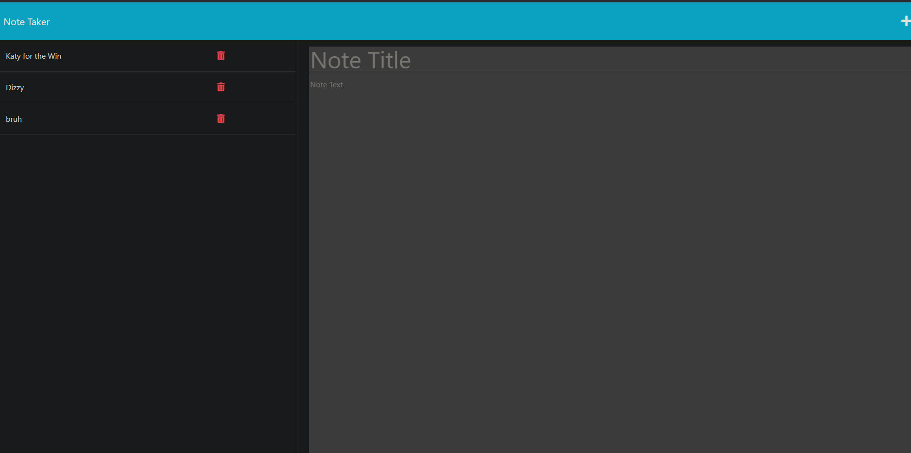
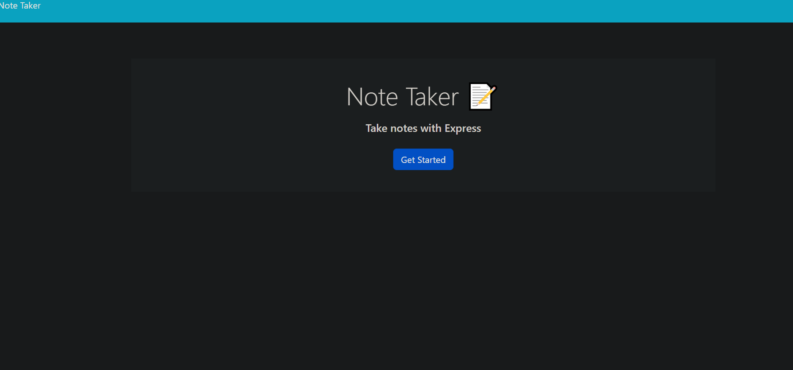

# NOTE TAKER V.2

## Description

  This application is a server run note taking app, hosted by heroku. This application lets you take notes, save notes, and delete notes, all with routing from express, for a clean secure website! Additionally the way this is setup anyone can see your notes!

## Preview

  THIS WEBSITE IS HOSTED LIVE [HERE](https://note-taker-app-v2.herokuapp.com/)

  
  

## Table of Contents

- [why?](#why)
- [Installation](#installation)
- [Usage](#usage)
- [Tech-Stack](#tech-stack)
- [License](#license)

## WHY

  This assignment is a fantastic way to start using express and routing with express in a comprehensive and use full way. This project was great practice with routing, understanding how routing works, and understanding how servers work and how I can make my best use of them. Lastly this was great practice for learning how to implement databases into my code and servers.

## Installation

  - you can view and use this website [HERE](https://note-taker-app-v2.herokuapp.com/), viewing it this way is much much easier than downloading and running this web server on your local machine, but instructions to run this locally are below.

  - please clone or download this repository [HERE](https://github.com/whotf1/noteTakerAppV2).

  - once your file is setup with contents open this project with a terminal running with node, or that has access to node.

  - then run npm i, to install dependencies for this project

  - then run node server, you will get a clickable link in the console of a locally working version of this website

## Usage

  do whatever you want with this project if you have questions feel free to contact me @ milocohenelyanow@gmail.com

  please note: this project was worked on significantly more in v1, you can find the repository [HERE](https://github.com/whotf1/noteTakerApp) hopefully you can learn something!

## Tech Stack

    - NODE: Express
    - working with databases
    - In depth Advanced file structuring

## License

  MIT License

Copyright (c) [2023] [Milo Cohen-Elyanow]

Permission is hereby granted, free of charge, to any person obtaining a copy
of this software and associated documentation files (the "Software"), to deal
in the Software without restriction, including without limitation the rights
to use, copy, modify, merge, publish, distribute, sublicense, and/or sell
copies of the Software, and to permit persons to whom the Software is
furnished to do so, subject to the following conditions:

The above copyright notice and this permission notice shall be included in all
copies or substantial portions of the Software.

THE SOFTWARE IS PROVIDED "AS IS", WITHOUT WARRANTY OF ANY KIND, EXPRESS OR
IMPLIED, INCLUDING BUT NOT LIMITED TO THE WARRANTIES OF MERCHANTABILITY,
FITNESS FOR A PARTICULAR PURPOSE AND NONINFRINGEMENT. IN NO EVENT SHALL THE
AUTHORS OR COPYRIGHT HOLDERS BE LIABLE FOR ANY CLAIM, DAMAGES OR OTHER
LIABILITY, WHETHER IN AN ACTION OF CONTRACT, TORT OR OTHERWISE, ARISING FROM,
OUT OF OR IN CONNECTION WITH THE SOFTWARE OR THE USE OR OTHER DEALINGS IN THE
SOFTWARE.

[CHECKOUTLISCENCEHERE](https://choosealicense.com/licenses/mit/)